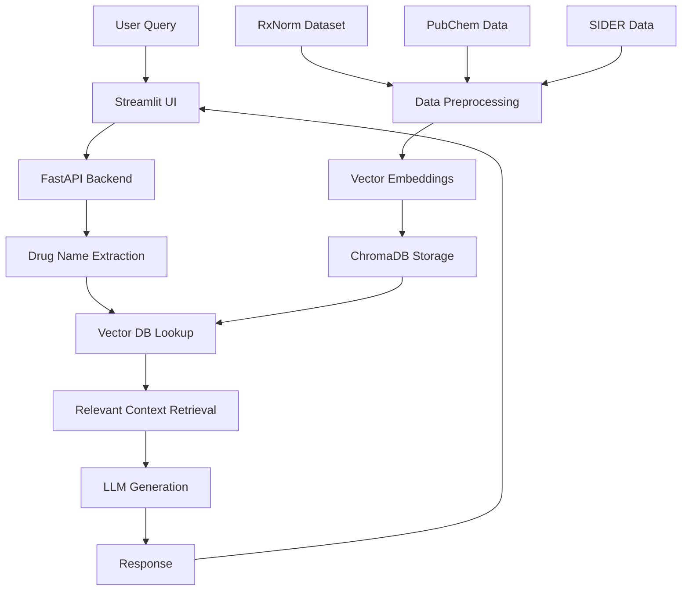

# 🔬 Drug Interaction Analyzer

[](https://opensource.org/licenses/MIT)
[](https://www.python.org/downloads/)
[](https://fastapi.tiangolo.com/)
[](https://streamlit.io/)

An AI-powered tool for healthcare professionals to quickly check drug interactions using open-source datasets and advanced NLP models.


## 📋 Table of Contents

- [Overview](#overview)
- [Key Features](#key-features)
- [Tech Stack](#tech-stack)
- [Getting Started](#getting-started)
  - [Prerequisites](#prerequisites)
  - [Installation](#installation)
- [Usage](#usage)
- [System Architecture](#system-architecture)
- [Dataset Information](#dataset-information)
- [Development Roadmap](#development-roadmap)
- [Contributing](#contributing)
- [License](#license)
- [Contact](#contact)

## 🔍 Overview

The Drug Interaction Analyzer leverages Retrieval-Augmented Generation (RAG) and cutting-edge NLP models to provide healthcare professionals with accurate and reliable information on potential drug interactions. By combining open-source medical datasets with fine-tuned language models, this tool delivers evidence-based insights tailored to clinical needs.

## ✨ Key Features

- **Accurate Interaction Detection**: Using RxNorm, PubChem, and SIDER datasets to identify potential drug-drug interactions
- **Context-Aware Responses**: RAG approach ensures responses are grounded in medical literature
- **Simple User Interface**: Easy-to-use Streamlit interface for quick interaction checks
- **API Access**: FastAPI backend enables integration with existing healthcare systems
- **Medically Relevant**: Fine-tuned on biomedical language models (PubMedBERT)

## 🛠️ Tech Stack

| Component | Technology |
|-----------|------------|
| **Model** | PubMedBERT, SciBERT, Mistral-7B |
| **Data Sources** | RxNorm, PubChem, SIDER |
| **RAG System** | LangChain + ChromaDB |
| **Backend** | FastAPI |
| **Frontend** | Streamlit |
| **Deployment** | Docker + Hugging Face Spaces |

## 🚀 Getting Started

### Prerequisites

- Python 3.8+
- pip
- Git

### Installation

```bash
# Clone this repository
git clone https://github.com/yourusername/drug-interaction-analyzer.git
cd drug-interaction-analyzer

# Create and activate virtual environment
python -m venv venv
source venv/bin/activate  # On Windows: venv\Scripts\activate

# Install dependencies
pip install -r requirements.txt

# Download model and initial data
python scripts/download_data.py
```

## 💻 Usage


### Run the Streamlit UI

```bash
cd frontend
streamlit run app.py
```

Then open your browser and navigate to http://localhost:8501

## 🏗️ System Architecture



## 📊 Dataset Information

The system uses the following open-source medical datasets:

- **RxNorm**: Standard nomenclature for clinical drugs
- **PubChem**: Information on chemical structures and bioactivities
- **SIDER**: Database of drug side effects
- **DIKB**: Drug Interaction Knowledge Base

## 📝 Example API Usage

```python
import requests

# Check interaction between two drugs
response = requests.get(
    "http://localhost:8000/check_interaction/",
    params={"drug1": "Aspirin", "drug2": "Warfarin"}
)

print(response.json())
```

## 🗓️ Development Roadmap

- [x] Initial RAG system with RxNorm data
- [x] Basic API and Streamlit UI
- [ ] Fine-tune PubMedBERT further on specific interaction datasets
- [ ] Add SIDER and clinical trials data
- [ ] Implement voice input via Whisper API
- [ ] Expand to drug-food interactions
- [ ] Create mobile app version

## 🤝 Contributing

Contributions are welcome! Please check out our [contribution guidelines](CONTRIBUTING.md) first.

1. Fork the repository
2. Create your feature branch (`git checkout -b feature/amazing-feature`)
3. Commit your changes (`git commit -m 'Add some amazing feature'`)
4. Push to the branch (`git push origin feature/amazing-feature`)
5. Open a Pull Request

## 📄 License

This project is licensed under the MIT License - see the [LICENSE](LICENSE) file for details.

## 📬 Contact

Project Maintainer - [pandey.06abhit@gmail.com](mailto:pandey.06abhit@gmail.com)

Project Link: [https://github.com/pAbhit007/drug-interaction-analyzer](https://github.com/pAbhit007/drug-interaction-analyzer)

---

<details>
<summary>📚 Citations and References</summary>

- Nelson SJ, Zeng K, Kilbourne J, Powell T, Moore R. Normalized names for clinical drugs: RxNorm at 6 years. J Am Med Inform Assoc. 2011;18(4):441-448.
- Kuhn M, Letunic I, Jensen LJ, Bork P. The SIDER database of drugs and side effects. Nucleic Acids Res. 2016;44(D1):D1075-D1079.
- Gu Y, Tinn R, Cheng H, et al. Domain-Specific Language Model Pretraining for Biomedical Natural Language Processing. ACM Trans Comput Healthc. 2021;3(1):1-23.

</details>
